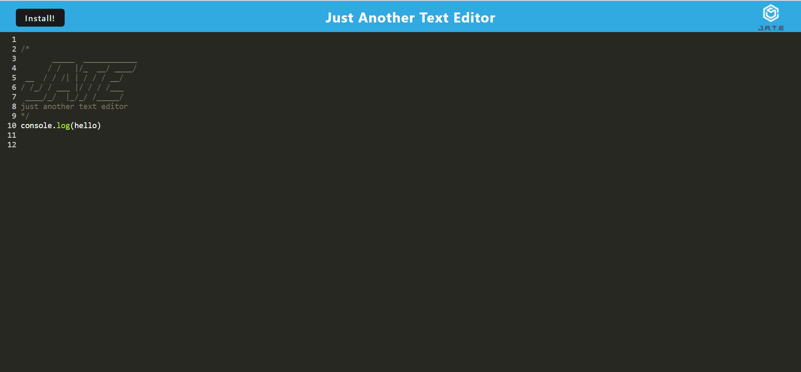
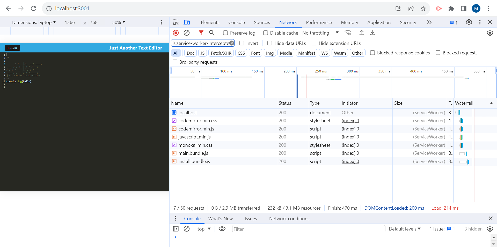
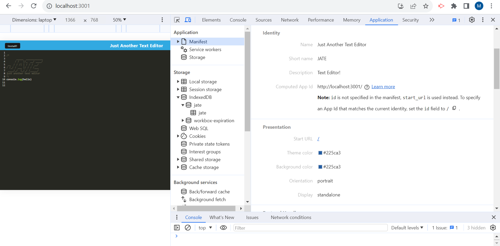
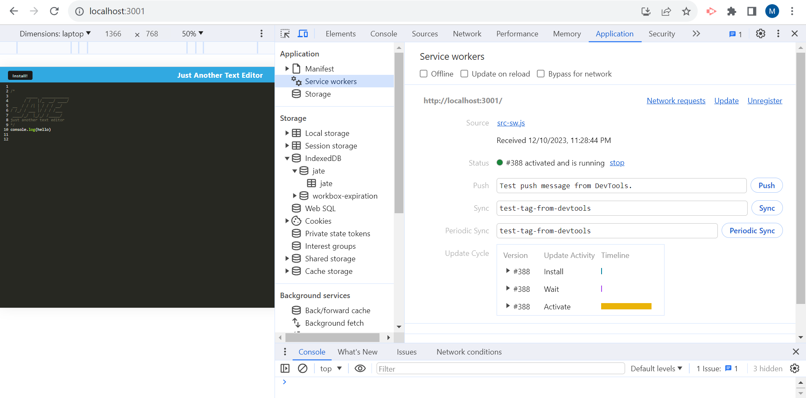
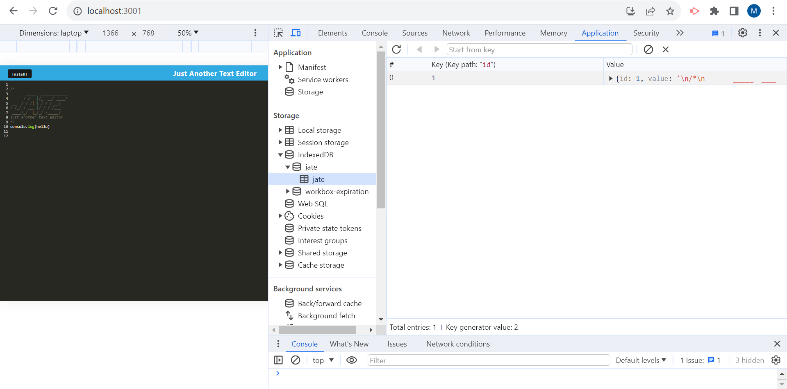

# JATE - Just Another Text Editor

## Description

JATE is a text editor that meets the Progressive Web Application (PWA) criteria, featuring a number of data persistence techniques to provide redundancy in case certain options are not supported by the browser. The application also functions offline, making it a versatile tool for editing and managing text files directly in a web browser.

## Features

- Text editing with syntax highlighting.
- Data persistence using IndexedDB for offline functionality.
- Service worker integration for PWA capabilities.
- Responsive design for use on various devices and screen sizes.
- Local storage fallback when IndexedDB is not available.

## Technology Stack

- JavaScript
- Express.js
- CodeMirror for the text editor interface.
- Webpack for bundling and build process.
- Workbox for service worker functionality.
- IndexedDB for client-side storage.

## Installation

To set up JATE on your local machine:

1. Clone the repository to your local machine.
2. Install the necessary dependencies for both server and client.
   \`\`\`
   npm run install
   \`\`\`
3. To run the application in development mode:
   \`\`\`
   npm run start:dev
   \`\`\`
4. For production build:
   \`\`\`
   npm run build
   \`\`\`

## Usage

After starting the application, navigate to http://localhost:3001 in your web browser. The text editor interface should be ready for use. Any text you type will be saved automatically, and you can access this data even when offline, thanks to the service worker and IndexedDB integration.

## Screenshots

## Deployed Github link

https://nabil1294.github.io/Progressive-Web-Applications-PWA--Text-Editor/

## Deployed Heroku link

https://infinite-shore-95091-dbb5d0e5c816.herokuapp.com/